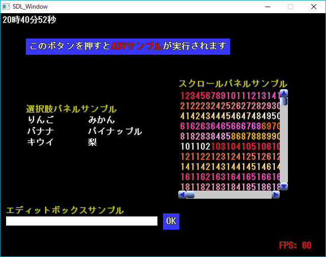
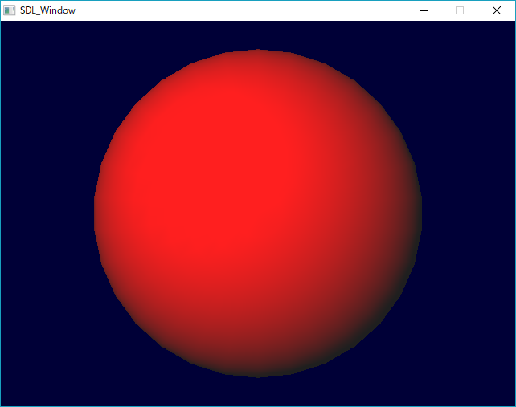
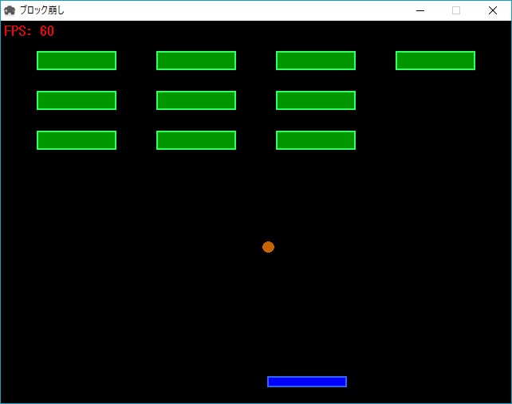
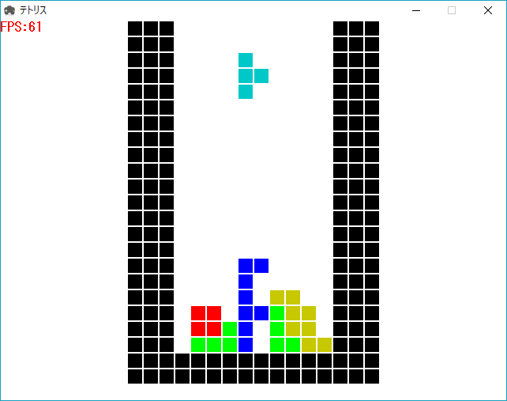
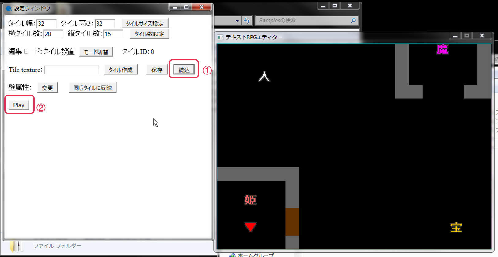
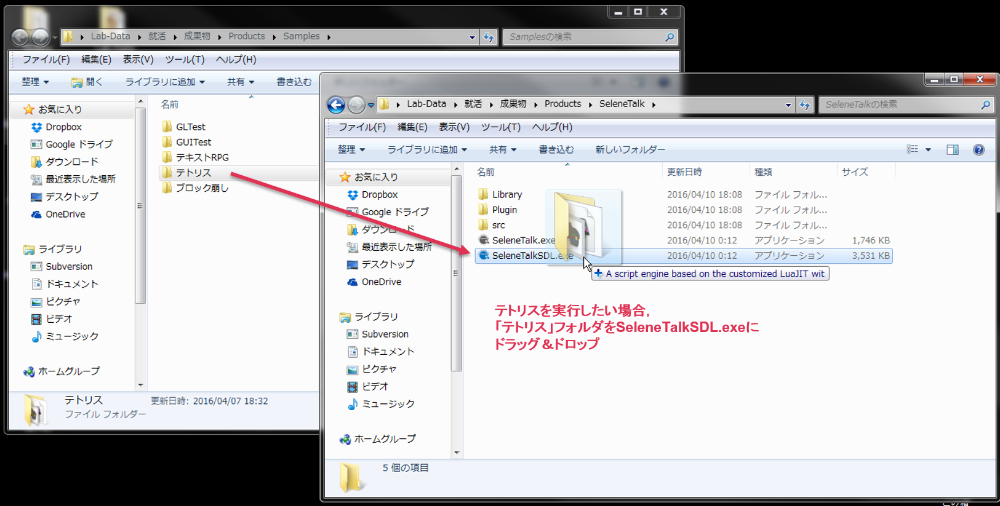

# 簡易2Dゲームエンジン

## 使用言語
[SeleneTalk](https://github.com/amenoyoya/SeleneTalk)（LuaJITベースの独自スクリプト言語）

---

## 最終バージョン
ver. 1.5.0

---

## 概要
SeleneTalk（ver. 3.0.0）で実装されたWindows用の2Dゲームエンジン

当時所属していた同人サークルで、ノベルゲームを作るために製作した

クロスプラットフォームで動作するようにOpenGLを描画エンジンに採用したが、最終的にWindows以外のプラットフォームでリリースすることはなかった

---

## 動作環境
Microsoft Windows 7 64bit, Windows 8 64bit, Windows 10 32bit環境で動作確認済み

描画エンジンにOpenGLを使用しているため、OpenGLが動作する環境が必要

---

## サンプルプログラム
動作サンプルとして、以下のプログラム・ゲームを同梱している

1. GUITest  
  
メッセージウィンドウ、スクロールパネル、ボタンなど、このゲームエンジンで使用可能なGUI部品の動作テスト用プログラム  

2. GLTest  
  
OpenGLを使った3D描画のテスト用プログラム  

3. ブロック崩し  
  
シンプルなブロック崩しゲーム  
【操作方法】  
　← →キー：バーの左右移動  

4. テトリス  
  
シンプルなテトリスゲーム  
【操作方法】  
　← →キー：ブロックの左右移動  
　↑キー：ブロックの右回転  
　↓キー：ブロックの高速落下  

5. テキストRPGつくーる  
  
テキストRPG製作ツール。極めて基本的な機能のみ実装  
【サンプルマップの遊び方】  
　設定ウィンドウの読込ボタンを押して、ファイル選択ダイアログで`テキストRPG`フォルダ内の`Map.dat`を選ぶ  
　サンプルマップが読み込まれたらPlayボタンを押してサンプルRPGを実行する  
　主人公は▼で、カーソルキーで動かすことができる  
　また、ENTERキーで会話したり宝箱を開けたりすることができる

### サンプルプログラムの実行方法
`bin/Samples`フォルダ内に各サンプルプログラムのフォルダが置いてある

実行したいプログラムのフォルダを`bin/SeleneTalk/SeleneTalkSDL.exe`にドラッグ＆ドロップすることでゲームを実行することが出来る

